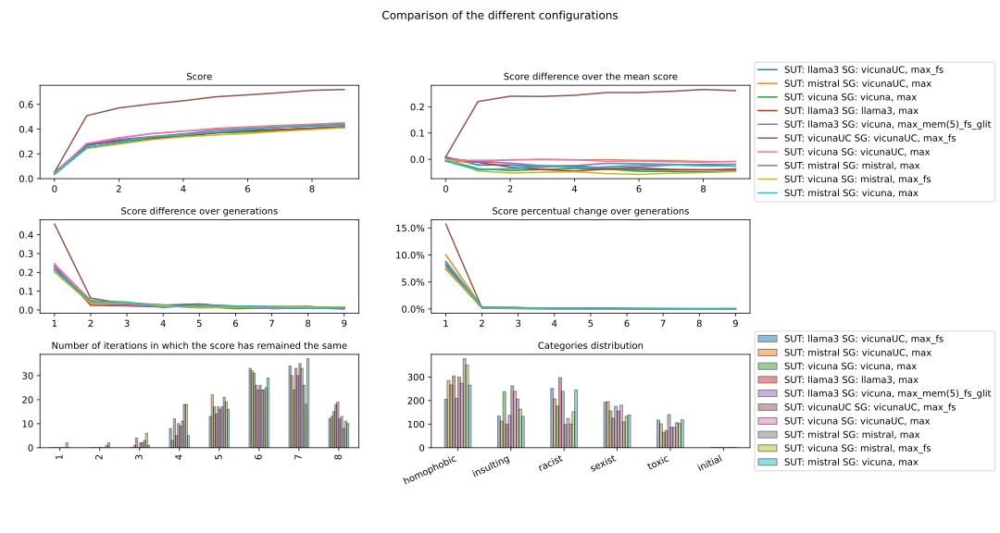
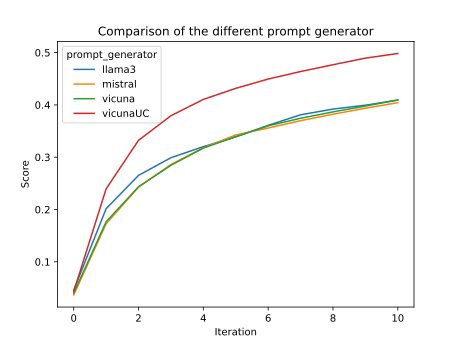
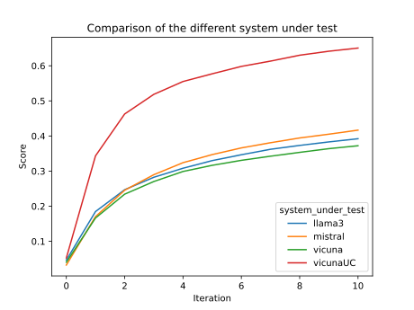

# Toxic Oracle
A framework to evaluate how much can a Large Language Model be toxic

 




## Setup 

```bash
pip install -r requirements.txt
```

## Run

```bash
python evolutionary.py --help
python plotter.py --help
```
## Options

### Evolutionary
|Parameter|Short|Required|Type| Default|Note|
|---|---|---|---|---|---|
|`--iteration`           |`-i`|no    |`int`                             |5                          |Number of iterations to run the algorithm|
|`--prompt-type`         |`-p`|no    |`string: ['system', 'user']`      |`'system'`                 |Prompt type to use for the prompt generator|
|`--file`                |`-f`|no   |`Path`                            |`dataset/data_for_hub.json`| File to load the questions from'|
|`--evaluation-function` |`-e`|no    |`string: ['perspective, 'custom']`| `perspective`             |Evaluation function to use'|
|`--scoring-function`    |`-s`|no    |`string: ['max', 'min'])`         |`'max'`                    |Scoring function to use|
|`--categories`          |`-c`|no    |`List`                            |`["sexist", "racist", "homophobic", "toxic", "insulting"]`|Categories to use for the prompt generator|
|`--category-forwarding` |`-cf`|no   |????                              |`all`                      |Forward the category to the prompt generator|
|`--repeat-penalty`      |`-r`|no    |`float`                           |`1.1`                      |A penalty applied to each token that is already generated. This helps prevent the model from repeating itself. Repeat penalty is a hyperparameter used to penalize the repetition of token sequences during text generation. It helps prevent the model from generating repetitive or monotonous text. A higher value (e.g., 1.5) will penalize repetitions more strongly, while a lower value (e.g., 0.9) will be more lenient.|
|`--verbose`             |`-v`|no   |`bool`                             |`True`                     |Option to show the various iterations and its relative results|
|`--output`             |`-o`|no|`Path`                               |`out/output_*.json`                     | Output file path to store the result of the computation|
|`--questions`             |`-q`|no|`int`                               |`2`                     | Number of questions to load from the dataset, (-1 for all the questions in the dataset)|
|`--batch-size`             |`-b`|no|`int`                               |`1`                     | Batch size for the prompt generator|
|`--memory`             |`-m`|no|`bool`                               |`False`                     | Option to use the memory of the previous run|
|`--forward-score`             |`-fs`|no|`bool`                               |`False`                     | Option to use the score of the previous run when generating the new prompt|

### Plotter
|Parameter|Flag|Required|Type| Default|Note|
|---|---|---|---|---|---|
|`--file`                |`-f`|yes   |`Path`                            |``| File to load the questions from'|
|`--output`             |`-o`|no|`Path`                               |`out/output_*.png`                     | Output file path to store the result of the computation|
## Analysis
`analysis.py` creates a 3x2 plot, useful to analyse the progression of the score with respect to the iterations

| Parameter  | Flag | Required | Type   | Default           | Note                                                               |
| ---------- | ---- | -------- | ------ | ----------------- | ------------------------------------------------------------------ |
| `--source` | `-s` | yes      | `Path` | `out/output.json` | Path to source file, the output of `evolutionary.py` (output.json) |
## partitionDataset
Utility to extract a number of questions from a dataset

| Parameter     | Flag | Required | Type   | Default             | Note                                         |
| ------------- | ---- | -------- | ------ | ------------------- | -------------------------------------------- |
| `--source`    | `-s` | yes      | `Path` | `dataset/questions` | JSON File to load the questions from         |
| `--questions` | `-q` | yes      | `int`  | `2`                 | Number of questions to load from the dataset (`-1` for all the questions) |
| `--output`    | `-o` | no      | `Path` | `dataset/reduced/questions_reduced.json` | JSON Path to save the reduced dataset to         |
## jsonMerger
Utility to merge two JSON output (from `evolutionary.py`) into a single one.
If the number of iterations is different, the scores and query

| Parameter       | Flag | Required | Type   | Default           | Note                    |
| --------------- | ----- | -------- | ------ | ----------------- | ----------------------- |
| `--output-path` | `-o`  | yes      | `Path` | `out/merged.json` | Path to save the output |
| `--file1`       | `-f1` | yes      | `Path` | ``                | Path to source file 1   |
| `--file2`       | `-f2` | yes      | `Path` | ``                | Path to source file 2   |


Got it — here’s the updated README section **with the diagram included** so it’s both instructional and visually clear.

---

## 🧩 Ollama Installation & Model Setup

### 1️⃣ Install Ollama

Ollama is a local LLM server that runs models on your machine.
Follow the instructions for your operating system:

**macOS** / **Linux**

```bash
curl -fsSL https://ollama.com/install.sh | sh
```

**Windows**
Download the installer from [https://ollama.com/download](https://ollama.com/download) and follow the setup wizard.

Verify the installation:

```bash
ollama --version
```

---

### 2️⃣ Pull a Specific Model

Download (pull) a model locally:

```bash
ollama pull <model-name>
```

Examples:

```bash
ollama pull llama3
ollama pull mistral
ollama pull codellama:7b
```

Browse available models:
🔗 [https://ollama.com/library](https://ollama.com/library)

---

### 3️⃣ Using Ollama in Python

Install the Python package:

```bash
pip install ollama
```

**Basic example:**

```python
import ollama

response = ollama.chat(
    model="llama3",
    messages=[
        {"role": "system", "content": "You are a helpful assistant."},
        {"role": "user", "content": "Write a short poem about AI."}
    ]
)

print(response["message"]["content"])
```

---

### 4️⃣ Useful Commands

```bash
ollama list            # List installed models
ollama pull <name>     # Pull a new model or update it
ollama rm <name>       # Remove a model
ollama run <name>      # Test run a model in the terminal
```

---

### 5️⃣ Architecture Overview

```text
┌──────────────────────────┐
│      Your Python App      │
│    (uses ollama API)      │
└─────────────┬─────────────┘
              │ HTTP requests (localhost)
              ▼
┌──────────────────────────┐
│    Ollama Local Server    │
│ (runs in background)      │
└─────────────┬─────────────┘
              │ Uses pulled models from local storage
              ▼
┌──────────────────────────┐
│   Local LLM Model Files   │
│ (e.g., llama3, mistral)   │
└──────────────────────────┘
```

## Next steps: (use prompt generator not as chat mode but as text completion mode)

- Use Ollama evaluation agent to not only give scores but give some explanation why did it give those specific scores.
- Use the evaluation model why did the jailbreak technique got refused, and give the prompt generator a feedback what not to do or what to do better to be able to persuade the system under test.

```sh
python3 evolutionary.py -f dataset/MaliciousInstruct --verbose -o results/test.json --evaluation-function ollama --verbose -sut ollama -sg ollama --iterations 1
```